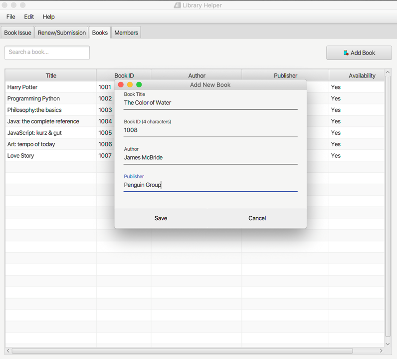

# Library Helper


==============
CS 151 - Object-Oriented Design  
Collaborators (Group 15): 
1. Duy Le (012719785)   
2. Tuong Chu (013395317)  
3. Duy Tran (013777881)  

Library Helper is a desktop application whose purpose is to help library assistants manage members and book rentals.

# Main features
- View books/members
- Search books/members
- Add, edit, delete books/members
- Issue books
- Submit books
- Renew books

More details in: [Slides](https://github.com/tchu1997/151Project/blob/master/Screenshots.pptx)
# Technologies used
Languages: Java 8, JavaFx 

Database: Apache Derby

Software: Netbeans IDE

Instructions on how to run the application:  
-----  

- If java 8 is not installed, please install Java 8 and above at [here](https://www.oracle.com/technetwork/java/javase/downloads/jdk8-downloads-2133151.html)

1. Download and unzip the source code.

  * In Windows: open file Library Helper.exe at  
 ~/Library Helper Software/Library Helper.exe  
 
  * In Mac OS: open file LibraryHelper.jar at  
 ~/LibraryHelper/dist/LibraryHelper.jar

2. Then, follow the walkthrough in the powerpoint slides: Screenshots.pptx

Project Github's link: [151 Project](https://github.com/tchu1997/151Project)

Thank you.
Group 15

# License
```
Copyright [1999] [Duy Le, Tuong Chu, Duy Tran]

Licensed under the Apache License, Version 2.0 (the "License");
you may not use this file except in compliance with the License.
You may obtain a copy of the License at

    http://www.apache.org/licenses/LICENSE-2.0

Unless required by applicable law or agreed to in writing, software
distributed under the License is distributed on an "AS IS" BASIS,
WITHOUT WARRANTIES OR CONDITIONS OF ANY KIND, either express or implied.
See the License for the specific language governing permissions and
limitations under the License.Library Helper - Group 15
```
